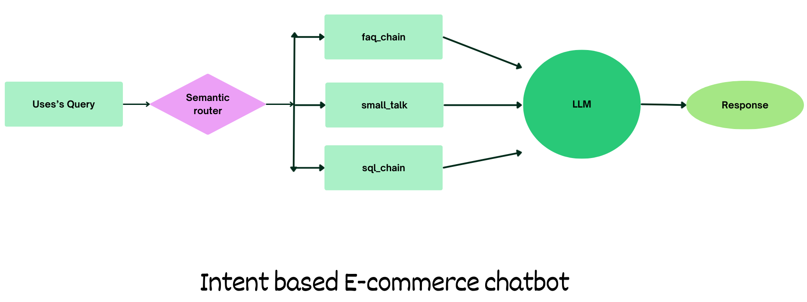

# 💬 e-commerce chatbot (Gen AI RAG project using LLama3.3 and GROQ)

Built an intent-driven e-commerce chatbot with a semantic routing architecture that intelligently dispatches queries to specialized pipelines (FAQ RAG, SQL generation, and conversational handling). Integrated real-time structured data retrieval and LLM-based response synthesis. Implemented response caching, query logging, and SQL safety validation to enhance performance, observability, and robustness. Designed the system with modular, production-oriented principles.

Folder structure

1. app: All the code for chatbot
2. web-scraping: Code to scrap e-commerce website 

This chatbot currently supports three intents:

- **faq**: Triggered when users ask questions related to the platform's policies or general information. eg. Is online payment available?
- **sql**: Activated when users request product listings or information based on real-time database queries. eg. Show me all nike shoes below Rs. 3000.
- **small talk**: Used for casual conversation, greetings, or general interaction that does not require database access or policy retrieval.
Examples: “How are you?”, “What is your name?”, “What do you do?”

## App screenshot


## Architecture



###  Setup & Execution
1️. Clone the repository
   ```bash
      git clone https://github.com/yourusername/intent-based-ecommerce-chatbot.git
      cd intent-based-ecommerce-chatbot
   ```
2️. Install dependencies
    
      pip install -r app/requirements.txt

3️. Setup the database

Run:

      python setup_db.py

This will automatically create:

      database/ecommerce.db

using the provided schema and seed data.

4️. Configure environment variables

Create a .env file inside the app/ directory:

      GROQ_MODEL=<Add the model name, e.g. llama-3.3-70b-versatile>
      GROQ_API_KEY=<Add your groq api key here>

5️. Run the application
   ```bash
   streamlit run app/main.py
   ```
